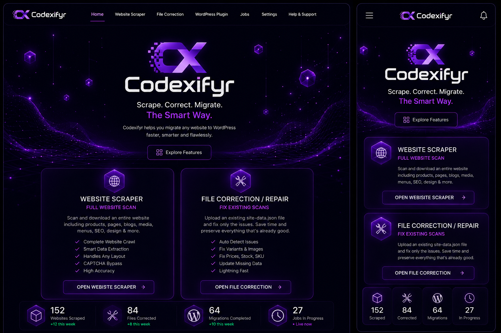
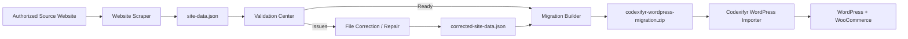
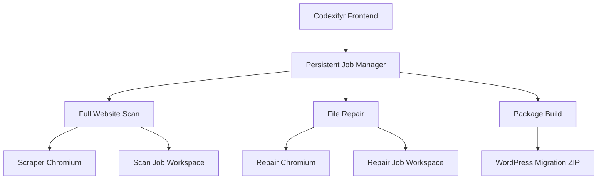

# Codexifyr WebLab

Codexifyr WebLab combines the WordPress website migration suite, targeted file correction, read-only validation, and the user's proven Shopify Product Scraper in one desktop application. The bundled `tools/shopify_scraper/scraper.py` is intentionally kept byte-for-byte unchanged from the supplied working scraper.


A local-first website-to-WordPress migration suite for sites you own or are authorized to reproduce. Codexifyr combines a full website crawler, targeted file correction, persistent background jobs, migration validation, a one-ZIP WordPress export workflow, and a standalone WordPress/WooCommerce importer plugin.



> The interface uses a black + neon/dark-purple theme and is responsive for desktop/laptop and mobile browsers. The desktop application itself is not a mobile app; when hosted, the frontend is mobile-friendly.

## What is included

- **Website Scraper** — scans an authorized source site from scratch.
- **File Correction / Repair** — uploads an existing `site-data.json` and repairs only selected/suspicious fields.
- **Job History** — keeps running, interrupted, stopped and completed jobs separate.
- **Validation Center** — detects suspicious data patterns before WordPress export.
- **Migration / Export** — builds and downloads the complete WordPress migration ZIP.
- **WordPress Plugin page** — explains and downloads the standalone Codexifyr importer.
- **Info / Documentation** — quick start, file meanings, diagnostics and limitations.

The Website Scraper and File Correction tool use independent background jobs. Navigating to another frontend page does **not** stop either job, and both can run simultaneously in separate browser sessions.

## Architecture



### Parallel job model



Each job has its own workspace under `runtime/jobs/<job-id>/`, preventing simultaneous jobs from overwriting each other's JSON, logs, checkpoints or packages.

## Windows quick start

Normal use does not require a command prompt.

1. Extract the project ZIP.
2. Double-click **`START CODEXIFYR MIGRATOR.bat`**.
3. On the first run, Codexifyr creates `.venv`, installs Python requirements and installs Playwright Chromium.
4. The local frontend opens automatically at `http://127.0.0.1:8877/`.

Subsequent runs reuse the virtual environment.

## Full website scan

The crawler is sitemap-first but always establishes a real browser session on the homepage before sitemap discovery. It captures same-domain public content and avoids normal utility/asset URLs such as uploads, cart, checkout, account/admin pages and non-HTML files.

Captured data can include:

- Pages and homepage content
- Blog posts, blog categories and tags
- WooCommerce products
- Product categories and tags
- Product attributes and real variations
- Size, color/colour, waist, length and custom attributes
- Variation prices, stock/sold-out state and source SKU when present
- Product/variation images and galleries
- Menus
- SEO titles/descriptions
- Logo and favicon
- Media URLs
- Source design signals used by the generated WordPress theme

### Variant extraction

The WooCommerce variation engine uses layered detection instead of assuming one layout:

1. WooCommerce `data-product_variations` JSON.
2. JavaScript-initialized variation data from the live DOM.
3. WooCommerce `get_variation` AJAX requests for real attribute combinations.
4. Browser interaction fallback for custom swatch/select layouts that update variation IDs and images dynamically.

It preserves sold-out variations. Empty SKUs are allowed; Codexifyr does not invent SKUs when the source does not provide them.

## CAPTCHA / browser challenges

Codexifyr uses the same deliberately narrow manual challenge approach proven in the product scraper:

- Visible Chromium is the default.
- CAPTCHA/challenge detection is based on visible challenge markers, not HTTP status alone.
- HTTP `202` alone is not treated as CAPTCHA.
- The browser session is kept open while the user solves the challenge.
- Codexifyr does **not** reload the page after a solved challenge.
- The scan automatically resumes when the challenge disappears, or the user can click **Continue After CAPTCHA**.
- No CAPTCHA bypass is implemented.

## Checkpoints and restart recovery

Long migrations are persistent jobs.

For full scans, Codexifyr stores:

- partial `site-data.json`
- `scan-checkpoint.json` with completed/discovered/remaining URLs
- persistent job metadata

For File Correction, successful changes are appended to `repair-delta.jsonl` after each repaired source record. This avoids rewriting a very large JSON file after every product.

If Windows, the network, Chromium or Codexifyr restarts, an unfinished job is shown as **Interrupted** in Job History. Clicking **Resume** restores the saved queue/delta and skips work that already completed.

Permanent `404` and `410` pages are skipped without wasting retry attempts. Transient failures can still use the configured retry count.

## File Correction / Repair

File Correction accepts either:

- `site-data.json`
- a ZIP containing `site-data.json`

The original uploaded file is kept unchanged. Codexifyr first analyzes the data and flags patterns such as:

- product count exactly matching variant count
- products with only an empty/fallback `Default Title` variant
- missing product images
- missing categories
- missing SEO records
- missing source SKU (informational only; blank SKU is valid)

The user chooses which fields to repair. Unselected fields remain locked/preserved.

### Fast repair strategy

```text
existing site-data.json
        ↓
local structural validation
        ↓
identify affected source URLs
        ↓
visit only those URLs
        ↓
extract only selected/missing data
        ↓
merge changes into a corrected copy
        ↓
corrected-site-data.json
```

If only variants are broken, Codexifyr does not rescan blogs, menus, categories, homepage content and unrelated media.

After repair, the page provides:

- **Download Corrected site-data.json**
- **Download Repair Report**
- **Build Full WordPress Migration**
- **Download Full WordPress Migration ZIP**

The migration builder automatically uses the corrected JSON when it exists.

## Important files

### `site-data.json`

The master structured website capture. Keep it as a backup even after building the WordPress ZIP.

### `corrected-site-data.json`

The repaired master copy produced by File Correction. The original is not overwritten.

### `migration-report.json` / `repair-report.json`

Diagnostics explaining what was captured or changed.

### `codexifyr-source-theme.zip`

A generated WordPress theme artifact. It is also placed inside the full migration package. Normal users do **not** need to upload it separately.

### `codexifyr-wordpress-migration.zip`

The complete WordPress-ready package. Upload this file **inside the Codexifyr WordPress Importer**, not under WordPress → Plugins.

The ZIP contract always contains its active master data as `site-data.json` even when it was built from `corrected-site-data.json`.

## WordPress importer plugin

The project includes `codexifyr-migrator-importer.zip` and the editable plugin source under `wordpress-plugin/`.

Install once:

1. Install/activate WooCommerce for store migrations.
2. WordPress → Plugins → Add New → Upload Plugin.
3. Upload `codexifyr-migrator-importer.zip` and activate it.
4. Open WordPress Admin → **Codexifyr**.
5. Upload `codexifyr-wordpress-migration.zip`.
6. Click **INSTALL WEBSITE** / **RESUME IMPORT**.

The importer works in persistent batches for categories/tags, pages/blog posts and products, then imports menus/branding/front-page settings. It records import stage state in WordPress so the existing stage can resume. After import, it runs an expected-vs-imported verification for products, variations and page/blog content.

The importer can recreate:

- Pages and blog posts
- Blog categories/tags
- Product categories/tags
- Simple and variable WooCommerce products
- Variation attributes, prices, stock and images
- Product galleries
- Media sideloading with source-URL de-duplication
- Menus
- Site logo and favicon
- Front page selection
- Common Yoast, Rank Math and AIOSEO title/description meta fields
- Generated Codexifyr source theme installation/activation

## Validation Center

Validation is a quality gate, not a promise of pixel-perfect equivalence. The readiness score flags obvious structural problems before package creation. For example, `1,255 products / 1,255 Default Title variants` is treated as suspicious rather than a successful variable-product capture.

## Download behavior

The backend streams downloadable files with normal browser attachment headers. It does not require Internet Download Manager or any other download manager. A locally installed download manager may still choose to intercept browser downloads; that behavior is external to Codexifyr.

## Responsive frontend

Codexifyr is designed primarily for desktop/laptop migration work because visible browser sessions and long-running crawls are desktop workflows. The hosted frontend remains responsive/mobile-friendly so users can open the site from a phone, read documentation, inspect job status and access available pages.

## GitHub-ready repository

Codexifyr does **not** automatically initialize Git, commit, push or connect to GitHub.

Included repository hygiene:

- `.gitignore` excludes runtime jobs, customer/site captures, migration JSON, logs, venvs, secrets and generated packages.
- `.env.example` contains safe variable names only.
- `SECURITY.md` documents local data and credential handling.
- `CONTRIBUTING.md` documents crawler/plugin contribution expectations.

Before pushing a repository, always review `git status` and confirm no private website data or credentials are staged.

## Project layout

```text
Codexifyr-Website-Migrator-PRO/
├── backend/
│   ├── migrator.py          # crawler, variation engine, package builder
│   ├── repair.py            # validation + targeted field-level repair
│   └── server.py            # persistent multi-job HTTP backend
├── frontend/
│   ├── index.html           # home
│   ├── scraper.html
│   ├── repair.html
│   ├── jobs.html
│   ├── validation.html
│   ├── export.html
│   ├── plugin.html
│   ├── docs.html
│   └── assets/
├── wordpress-plugin/
│   └── codexifyr-migrator-importer/
├── runtime/                 # generated locally; ignored by Git
├── codexifyr-migrator-importer.zip
├── START CODEXIFYR MIGRATOR.bat
├── run.py
├── requirements.txt
├── .gitignore
├── .env.example
├── SECURITY.md
└── README.md
```

## Known limitations

Codexifyr is a migration/reconstruction system, not an automatic copy of every private implementation detail of an arbitrary source theme. Complex proprietary page-builder widgets, licensed scripts/fonts, custom animation logic, mega-menu plugins, reviews from inaccessible APIs, private WooCommerce settings, payment/shipping configuration and third-party account integrations may require manual work.

The generated WordPress theme is source-informed but not guaranteed to reproduce an arbitrary site's proprietary theme pixel-for-pixel.

Large WordPress imports can still be affected by hosting PHP memory/upload/time limits and remote source media availability. Test large packages on staging first.

## Development checks

```powershell
python -m py_compile backend\migrator.py backend\repair.py backend\server.py run.py
php -l wordpress-plugin\codexifyr-migrator-importer\codexifyr-migrator-importer.php
```

These commands are for development/testing only; normal Windows use is through the BAT launcher.

## Authorization

Use Codexifyr only for websites and content you own or are authorized to migrate/reproduce.

## Windows Desktop Edition

Version 3.1 adds a native Windows desktop shell powered by WebView2/pywebview while keeping the proven Python + Playwright migration engine. The scraper's visible Chromium window remains separate when manual CAPTCHA or variant interaction is required.

For normal installation, extract the release and double-click **`INSTALL CODEXIFYR.bat`**. It creates a branded desktop shortcut and Start Menu shortcut and stores runtime/customer data under `%LOCALAPPDATA%\Codexifyr WebLab\Data`, separate from application files so updates do not wipe jobs.

The repository also contains **`BUILD WINDOWS INSTALLER.bat`** plus the `installer/` sources for generating a distributable `Codexifyr-WebLab-Setup-v4.2.3.exe` on Windows with PyInstaller + Inno Setup 6. Public releases should be Authenticode code-signed rather than attempting to bypass Windows SmartScreen.

## Capture checkbox behavior (4.2.3)
WebLab separates **navigation/discovery** from **exported content**. The crawler may visit archive, category, sitemap, pagination, or other internal HTML pages to discover selected URLs. Those visits do not automatically make them part of the migration dataset. `site-data.json` stores only capture types selected in Scan Configuration. Product images and product variations are considered part of the Products capture. The generated JSON includes `capture_options` so Validation can distinguish intentionally omitted sections from missing data.
